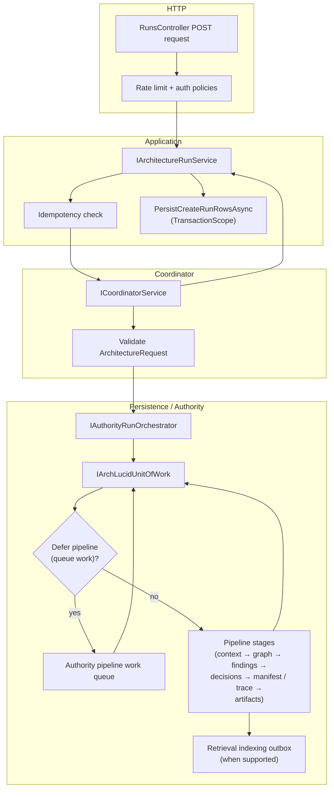
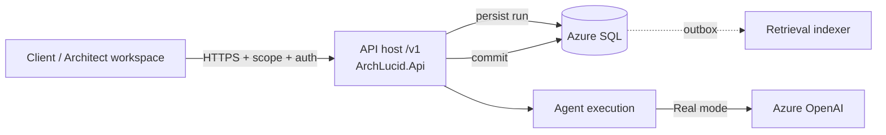

> **Scope:** Day one — Developer (week one) - full detail, tables, and links in the sections below.

> **Spine doc:** [`START_HERE.md`](../START_HERE.md).


# Day one — Developer (week one)

**Goal:** Ship a small, safe change or run the **ArchLucid** stack locally with confidence. **Not** full domain mastery. (Repo and projects: `ArchLucid.*`.)

**First run (before this page):** complete [`engineering/FIRST_30_MINUTES.md`](../engineering/FIRST_30_MINUTES.md) — the canonical Docker-only contributor path from `START_HERE.md`.

**Canonical operator action map:** [OPERATOR_ATLAS.md](../library/OPERATOR_ATLAS.md) (UI route × API × CLI × authority — use this instead of memorizing scattered onboarding-only lists).

> **Install order moved.** See [INSTALL_ORDER.md](../engineering/INSTALL_ORDER.md). This page covers Developer week-one tasks **after** install.

**Ticket:** `ONBOARD-DEV-001` (copy into your work tracker)

---

## Scope (3–5 outcomes — check off by end of week one)

- [ ] **1. Toolchain done** — You finished the **Local dev** column in the canonical one-pager (see [START_HERE.md](../START_HERE.md) first table row) — SDK, Docker/`dev up`, connection string, API **`/health/ready`**, optional UI `npm ci`.
- [ ] **2. Fast tests** — Run the Core corset (matches CI fast job):  
  `dotnet test --filter "Suite=Core&Category!=Slow&Category!=Integration"` ([TEST_EXECUTION_MODEL.md](../library/TEST_EXECUTION_MODEL.md)).
- [ ] **3. One contract** — Skim [API_CONTRACTS.md](../library/API_CONTRACTS.md) (versioning `/v1`, correlation ID, one status code you will handle).
- [ ] **4. Small change** — Open a PR with a **tiny** change (doc typo, test name, log message) so you practice the full loop (build + Core tests + green CI).
- [ ] **5. (Optional) Custom agent handler** — If you extend the authority pipeline, skim [`CUSTOM_AGENT_HANDLER_GUIDE.md`](../library/CUSTOM_AGENT_HANDLER_GUIDE.md) (in-repo) vs [`CUSTOM_AGENT_HANDLERS.md`](../library/CUSTOM_AGENT_HANDLERS.md) (out-of-process). Not required for week one.

---

## Fast path commands

If you just need the commands to get running locally (after installing prerequisites):

```powershell
git clone <your-fork-or-upstream-url> ArchLucid
Set-Location ArchLucid
dotnet restore
dotnet build ArchLucid.sln -c Release

# Start dependencies (SQL, Azurite, Redis)
docker compose --profile dev up -d

# Run fast tests
dotnet test ArchLucid.Core.Tests/ArchLucid.Core.Tests.csproj -c Release
dotnet test ArchLucid.Application.Tests/ArchLucid.Application.Tests.csproj -c Release --filter "Category!=SqlIntegration"

# Run the API
dotnet run --project ArchLucid.Api/ArchLucid.Api.csproj

# Run the UI (in a new terminal)
Set-Location archlucid-ui
npm install
npm run dev
```

---

## Escalation

| Blocker | Where |
|---------|--------|
| Build / packages | [BUILD.md](../engineering/BUILD.md), [TROUBLESHOOTING.md](../runbooks/TROUBLESHOOTING.md) |
| SQL / migrations | [SQL_SCRIPTS.md](../library/SQL_SCRIPTS.md) |
| Auth locally | [API_CONTRACTS.md](../library/API_CONTRACTS.md#security-schemes-swashbuckle) |

**Last reviewed:** 2026-07-20

---

## Mental model: `POST /v1/architecture/request`

**What this endpoint does:** Creates an architecture **review** (persisted with `RunId` / `ArchitectureRun` in APIs and SQL for compatibility), an **evidence bundle**, and **starter agent tasks** (when not deferred). It does **not** run the full agent simulation loop or manifest commit; those are separate execute/commit flows (`docs/API_CONTRACTS.md`).

**Flow (nodes and edges):**

1. **HTTP** — `POST /v1/architecture/request` on `RunsController` (`v1/architecture`). Policy **`ExecuteAuthority`**; **`EnableRateLimiting("fixed")`** on the controller. Optional **`Idempotency-Key`** for deduplication.
2. **Application** — `IArchitectureRunService.CreateRunAsync` checks idempotency, then calls **`ICoordinatorService.CreateRunAsync`**.
3. **Coordinator** — Validates `ArchitectureRequest`, builds an evidence bundle shell, calls **`IAuthorityRunOrchestrator.ExecuteAsync`** with a mapped context-ingestion request.
4. **Authority pipeline (Persistence)** — `AuthorityRunOrchestrator` opens **`IArchLucidUnitOfWork`**, persists the run, then either:
   - **Deferred path:** enqueues **authority pipeline work** (feature + resolver + non-empty deferred bundle id), **commits** the UoW, returns early with empty starter tasks; **or**
   - **Inline path:** **`IAuthorityPipelineStagesExecutor`** runs stages (context → graph → findings → decisions → manifest/trace → agents/artifacts as configured) inside the same orchestration, then finalizes commit, audit, and **retrieval indexing outbox** when supported.
5. **Application persistence (Data repos)** — On coordination success, `ArchitectureRunService` persists request/run/tasks (and related rows) inside a **`System.Transactions.TransactionScope`** — a **separate** transactional boundary from the authority UoW (two layers on purpose today; see `ArchitectureRunService` and ADR 0004 for manifest/trace split).

**Simulator vs Real:** `AgentExecution:Mode=Simulator` affects **`IAgentExecutor`** used on **execute**, not the create-request path directly. Create-request still runs the **authority** pipeline (or defers it) depending on storage and feature flags.



**Where to read code:** `ArchLucid.Api/Controllers/Authority/RunsController.cs`, `ArchLucid.Application/ArchitectureRunService.cs`, `ArchLucid.Coordinator/Services/CoordinatorService.cs`, `ArchLucid.Application/Runs/Orchestration/AuthorityRunOrchestrator.cs`.

---

## Following the request past create: execute → commit → retrieval → ask

The mental model above stops at **create**. The rest of the request's life follows the same auth/scope rules and lands in the same SQL-backed data plane:



1. **Authenticate** — API key (`X-Api-Key`) or JWT (Entra), per environment. Scope: `x-tenant-id`, `x-workspace-id`, `x-project-id` (or claims).
2. **Create run** — covered in the mental model above. For the **architect workspace** guided flow (presets → review → pipeline tracking), see [`CANONICAL_FIRST_RUN_PATH.md#first-run-wizard-architect-workspace`](../library/CANONICAL_FIRST_RUN_PATH.md#first-run-wizard-architect-workspace).
3. **Execute authority** — Pipeline stages ingest context, graph, findings, decisioning, artifacts (see traces: `ArchLucid.AuthorityRun` in logs/telemetry).
4. **Agents** — `AgentExecution:Mode` `Simulator` (deterministic) or `Real` (Azure OpenAI). Token usage and optional per-tenant metrics: [`OPERATIONS_LLM_QUOTA.md`](../library/OPERATIONS_LLM_QUOTA.md).
5. **Commit** — `POST /v1/architecture/review/{runId}/finalize` when the run is ready; handle `409` for invalid state.
6. **Retrieval** — After commit, indexing work is processed asynchronously; query `GET /v1/retrieval/search` when enabled.
7. **Ask (optional)** — Threaded Q&A uses the same scope and LLM stack; see Ask controller routes under `/v1/ask`.

**Architect workspace tip:** Press **Shift+?** while focus is outside text inputs to open the keyboard shortcuts overlay (global Alt shortcuts, Alerts shortcuts, Escape to close). Full reference: [`archlucid-ui/docs/KEYBOARD_SHORTCUTS.md`](../../archlucid-ui/docs/KEYBOARD_SHORTCUTS.md).

### Health, ops, and full regression

You won't need these day one, but they're the fastest way to answer "is my local stack actually healthy?" once you're past your first small PR:

- **Liveness:** `GET /health/live` · **Readiness:** `GET /health/ready` (SQL, schema, packs)
- **Admin (privileged):** `GET /v1/admin/diagnostics/outboxes`, `.../leases`, feature flags — see [`OPERATIONS_ADMIN.md`](../library/OPERATIONS_ADMIN.md)
- **Full .NET regression with SQL** (beyond the Core corset in the checklist above): `scripts/run-full-regression-docker-sql.ps1` / `.sh` (sets `ARCHLUCID_SQL_TEST`)
- **RTO / RPO tier defaults:** [`RTO_RPO_TARGETS.md`](../library/RTO_RPO_TARGETS.md) — production targets include relational RPO under five minutes via SQL geo-replication; [`runbooks/DATABASE_FAILOVER.md`](../runbooks/DATABASE_FAILOVER.md) for failover steps.
- **Architecture decisions:** [`architecture/adrs/README.md`](../architecture/adrs/README.md) explains non-obvious choices (hosting roles, RLS, LLM pipeline, etc.) if a "why is it built this way" question comes up while you're in the code.
