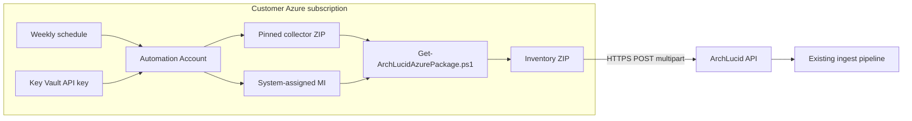

> **Scope:** Operator runbook — customer-owned scheduled Azure extractor (Automation runbook or Function timer); not buyer legal text.

> **Spine doc:** [`../START_HERE.md`](../START_HERE.md).

# Azure extractor — scheduled agent (recommended production path)

## 1. Objective

Collect read-only Azure inventory **on a timer in the customer tenant** and upload the ZIP to ArchLucid. After the agent is applied, operators do **not** pull data from a command line or vendor UI.

This is the preferred **customer-owned** production path for Azure. It reuses the same collector as Tier 1 (`Get-ArchLucidAzurePackage.ps1`) and the same ingest contract (`POST /v1/azure-extractor/upload`). ArchLucid-hosted workload-identity polling (Tier 2) remains optional when the customer wants ArchLucid to pull instead.

## 2. When to use which path

| Path | Who runs the collector | Credentials in customer tenant | Best for |
|------|------------------------|--------------------------------|----------|
| **Scheduled agent (this runbook)** | Customer Automation runbook or Function timer | System-assigned managed identity + Key Vault API key | Production cadence; InfoSec uncomfortable with laptop CLI or UI pull |
| **One-time local script (pilot)** | Operator workstation / Cloud Shell | Operator sign-in | First pilot, sandbox approval, narrow RG proof |
| **Hosted WIF pull (Tier 2)** | ArchLucid worker | Federated read-only SP (no customer secret stored in ArchLucid) | Customer wants vendor-operated polling |
| **Customer CI (GitHub Actions, etc.)** | Pipeline runner in customer estate | Pipeline OIDC / secrets | Estates that standardize on CI instead of Automation |

**Product default:** recommend the **scheduled agent** for Azure production estates. Keep one-time ZIP upload for pilots and optional Tier 2 when procurement accepts vendor pull.

## 3. Architecture



**Per run (Automation):**

1. Runbook signs in with `Connect-AzAccount -Identity`.
2. Downloads the pinned collector ZIP from customer storage (blob data plane).
3. Expands scripts and invokes `Invoke-ArchLucidScheduledAzureExtractor.ps1`.
4. Orchestrator runs `Get-ArchLucidAzurePackage.ps1` (Reader + optional Cost Management Reader).
5. Reads ArchLucid API key from Key Vault (or env) and **POST**s the ZIP to `/v1/azure-extractor/upload`.

ArchLucid never receives a client secret for the customer Azure subscription. The API key is an **ExecuteAuthority** key for upload only.

## 4. Repository layout

| Artifact | Path |
|----------|------|
| Terraform (Automation + schedule) | [`deploy/customer-templates/scheduled-agent/terraform/`](../../deploy/customer-templates/scheduled-agent/terraform/) |
| Automation runbook source | [`deploy/customer-templates/scheduled-agent/runbook/Invoke-ArchLucidScheduledAzureExtractor.Runbook.ps1`](../../deploy/customer-templates/scheduled-agent/runbook/Invoke-ArchLucidScheduledAzureExtractor.Runbook.ps1) |
| Function timer sample | [`deploy/customer-templates/scheduled-agent/function/`](../../deploy/customer-templates/scheduled-agent/function/) |
| Template README (quick apply) | [`deploy/customer-templates/scheduled-agent/README.md`](../../deploy/customer-templates/scheduled-agent/README.md) |
| Shared orchestrator | [`scripts/azure/Invoke-ArchLucidScheduledAzureExtractor.ps1`](../../scripts/azure/Invoke-ArchLucidScheduledAzureExtractor.ps1) |
| Upload helper | [`scripts/azure/Send-ArchLucidAzureExtractorPackage.ps1`](../../scripts/azure/Send-ArchLucidAzureExtractorPackage.ps1) |
| Shared helpers | [`scripts/azure/ArchLucid.ScheduledExtractor.helpers.ps1`](../../scripts/azure/ArchLucid.ScheduledExtractor.helpers.ps1) |
| Collector (unchanged) | [`scripts/azure/Get-ArchLucidAzurePackage.ps1`](../../scripts/azure/Get-ArchLucidAzurePackage.ps1) |

Validate templates locally (no Azure credentials):

```bash
python3 scripts/ci/validate_customer_wif_templates.py
```

## 5. Prerequisites

| Item | Requirement |
|------|-------------|
| Azure RBAC | **Reader** + **Cost Management Reader** on the inventoried subscription, assigned to the Automation **system-assigned** identity |
| ArchLucid | **ExecuteAuthority** API key; store in Key Vault (recommended) |
| Terraform | `>= 1.5.0`, `azurerm` `~> 4.0` |
| Network | Automation account and Key Vault reachable from your corporate network policy (public endpoint by default in template) |
| Schedule | Default **Monday 06:00 UTC**; first `schedule_start_time_utc` must be ≥ 5 minutes in the future at apply time |

**Roles ArchLucid will never request:** `Owner`, `Contributor`, `User Access Administrator`, Entra **Global Reader**, or any write/destructive subscription role. See [`../go-to-market/BUYER_SECURITY_PROCUREMENT_PACKET.md#azure-extractor--infosec-pre-read`](../go-to-market/BUYER_SECURITY_PROCUREMENT_PACKET.md#azure-extractor--infosec-pre-read).

## 6. Apply — Terraform (Automation runbook)

```bash
cd deploy/customer-templates/scheduled-agent/terraform
cp terraform.tfvars.example terraform.tfvars
```

Edit `terraform.tfvars` (minimum):

| Variable | Example | Notes |
|----------|---------|-------|
| `subscription_id` | Azure subscription GUID | Inventoried subscription |
| `archlucid_api_base_url` | `https://api.example.com` | No trailing slash |
| `archlucid_tenant_id` | ArchLucid tenant GUID | Sent as `X-Tenant-Id` on upload |
| `archlucid_workspace_id` | Workspace GUID | Sent as `X-Workspace-Id` |
| `schedule_start_time_utc` | `2026-09-22T06:00:00Z` | RFC3339 UTC |
| `include_cost` | `true` | Requires Cost Management Reader |
| `archlucid_api_key` | *(omit)* | Prefer setting Key Vault secret out of band |

```bash
terraform init
terraform validate
terraform apply
```

**If `archlucid_api_key` was omitted**, set the secret after apply:

```bash
az keyvault secret set \
  --vault-name "<key_vault_name output>" \
  --name archlucid-api-key \
  --value "<ExecuteAuthority API key>"
```

**Post-apply checklist:**

1. Wait until Automation modules **Az.Accounts**, **Az.Resources**, and **Az.ResourceGraph** finish importing (Automation Account → Modules).
2. Start runbook **`Invoke-ArchLucidScheduledAzureExtractor`** once manually and confirm **Completed**.
3. Confirm ArchLucid audit shows **`AzureExtractorPackage.Uploaded`** / **`AzureExtractorPackage.IngestSucceeded`** (see [`AZURE_EXTRACTOR_INGEST.md`](./AZURE_EXTRACTOR_INGEST.md)).

Terraform outputs: `automation_account_name`, `key_vault_name`, `collector_storage_account_name`, `automation_principal_id`, `next_step`.

## 7. Automation variables (set by Terraform)

| Variable | Purpose |
|----------|---------|
| `ARCHLUCID_AZURE_SUBSCRIPTION_ID` | Subscription to inventory |
| `ARCHLUCID_API_BASE_URL` | ArchLucid API origin |
| `ARCHLUCID_TENANT_ID` | `X-Tenant-Id` |
| `ARCHLUCID_WORKSPACE_ID` | `X-Workspace-Id` |
| `ARCHLUCID_PROJECT_ID` | Optional `X-Project-Id` |
| `ARCHLUCID_RUN_ID` | Optional review id (`runId` query on upload) |
| `ARCHLUCID_KEY_VAULT_NAME` | Vault holding API key |
| `ARCHLUCID_KEY_VAULT_SECRET_NAME` | Secret name (default `archlucid-api-key`) |
| `ARCHLUCID_COLLECTOR_STORAGE_ACCOUNT` | Blob account for pinned script ZIP |
| `ARCHLUCID_COLLECTOR_CONTAINER` | Container (default `extractor-scripts`) |
| `ARCHLUCID_COLLECTOR_BLOB_NAME` | Blob (default `archlucid-scheduled-extractor-scripts.zip`) |
| `ARCHLUCID_INCLUDE_COST` | `true` / `false` |

Re-run `terraform apply` after upgrading ArchLucid distribution tags to refresh the pinned collector ZIP in customer storage.

## 8. Function timer (same orchestrator)

Use [`deploy/customer-templates/scheduled-agent/function/`](../../deploy/customer-templates/scheduled-agent/function/) when the estate standardizes on Azure Functions instead of Automation.

1. Deploy a PowerShell 7 Function App with **system-assigned** managed identity.
2. Copy collector scripts from `scripts/azure/` plus `scripts/ArchLucid.AuthHeaders.ps1` next to `scheduled-extractor/run.ps1`.
3. Grant the identity **Reader**, **Cost Management Reader**, **Key Vault Secrets User**, and blob read on the script container if used.
4. Set app settings using the same names as the Automation variables in §7 (`ARCHLUCID_*`).
5. Timer default: `0 0 6 * * 1` (Monday 06:00 UTC).

`profile.ps1` connects with managed identity before the timer fires.

## 9. Manual test (orchestrator only)

For debugging outside Automation, on a machine or Cloud Shell with Az modules:

```powershell
./scripts/azure/Invoke-ArchLucidScheduledAzureExtractor.ps1 `
  -SubscriptionId "<azure-subscription-guid>" `
  -ApiBaseUrl "https://api.example.com" `
  -TenantId "<archlucid-tenant-guid>" `
  -WorkspaceId "<archlucid-workspace-guid>" `
  -KeyVaultName "<kv-name>" `
  -KeyVaultSecretName "archlucid-api-key" `
  -IncludeCost
```

Use `-DryRun` to execute collection without upload. Use `-ApiKey` or `$env:ARCHLUCID_API_KEY` only in non-production debugging — prefer Key Vault in production.

## 10. Security and compliance

- **Identity:** customer-owned system-assigned managed identity; no ArchLucid Entra app in the subscription for Tier 1 scheduled collection.
- **Secrets:** API key in Key Vault only; never commit to runbook source or Terraform state when avoidable (`archlucid_api_key` is optional and sensitive).
- **Collector pin:** script ZIP lives in **customer** storage; review before first apply and on ArchLucid version upgrades.
- **ZIP content:** same exclusions as Tier 1 — no Key Vault secret values, connection strings, or private keys. Treat uploaded ZIP as tenant-confidential configuration metadata.
- **Audit:** customer Automation / Function job history plus ArchLucid ingest audit events.

Buyer-facing summary: [`../go-to-market/trust-center.md`](../go-to-market/trust-center.md) § Cloud inventory connectivity.

## 11. Troubleshooting

| Symptom | Likely cause | Action |
|---------|--------------|--------|
| Runbook fails on module import | Az.Accounts / Az.Resources / Az.ResourceGraph still importing | Wait; re-run job |
| `Storage access token was empty` | MI missing **Storage Blob Data Reader** on collector account | Confirm `azurerm_role_assignment.blob_reader` applied |
| `Key Vault secret was empty` | Secret not set or MI missing **Key Vault Secrets User** | `az keyvault secret set` + RBAC |
| HTTP 401/403 on upload | Wrong API key or missing ExecuteAuthority | Rotate key; confirm scope headers |
| HTTP 422 on upload | Invalid ZIP or unsupported `schemaVersion` | Run collector locally with `-DryRun`; see [`AZURE_EXTRACTOR_INGEST.md`](./AZURE_EXTRACTOR_INGEST.md) |
| Subscription context errors | MI lacks Reader on subscription | Verify role assignment scope |
| Cost section missing | `include_cost=false` or missing Cost Management Reader | Set variable / RBAC |

PowerShell execution policy on workstations is irrelevant after Automation apply; for pilot CLI issues see [`EXTRACTOR_EXECUTION_POLICY_BYPASS.md`](./EXTRACTOR_EXECUTION_POLICY_BYPASS.md).

## 12. One-time local collection (pilot only)

Keep **Extract & upload** and `Run-ArchLucidAzureExtractor.ps1` for first pilots. UI copy labels this path **Pilot**; do not treat workstation pulls as production cadence.

## Related

| Doc | Use |
|-----|-----|
| [`../library/AZURE_EXTRACTOR.md`](../library/AZURE_EXTRACTOR.md) | Tier 1 ZIP, hosted WIF, auto-pull |
| [`AZURE_EXTRACTOR_INGEST.md`](./AZURE_EXTRACTOR_INGEST.md) | Upload API, schema, audit |
| [`AZURE_EXTRACTOR_TIER2_CONTINUOUS.md`](./AZURE_EXTRACTOR_TIER2_CONTINUOUS.md) | CI-owned alternative |
| [`FIRST_PILOT_OPERATOR_PATH.md`](./FIRST_PILOT_OPERATOR_PATH.md) | End-to-end pilot |
| [`../library/customer-facing/CLOUD_CONNECTIONS.md`](../library/customer-facing/CLOUD_CONNECTIONS.md) | In-app `/help/cloud-connections` source |
| [`../go-to-market/BUYER_SECURITY_PROCUREMENT_PACKET.md`](../go-to-market/BUYER_SECURITY_PROCUREMENT_PACKET.md) | InfoSec pre-read |
| [`../library/V1_SCOPE.md`](../library/V1_SCOPE.md) | §2.16 product scope |
