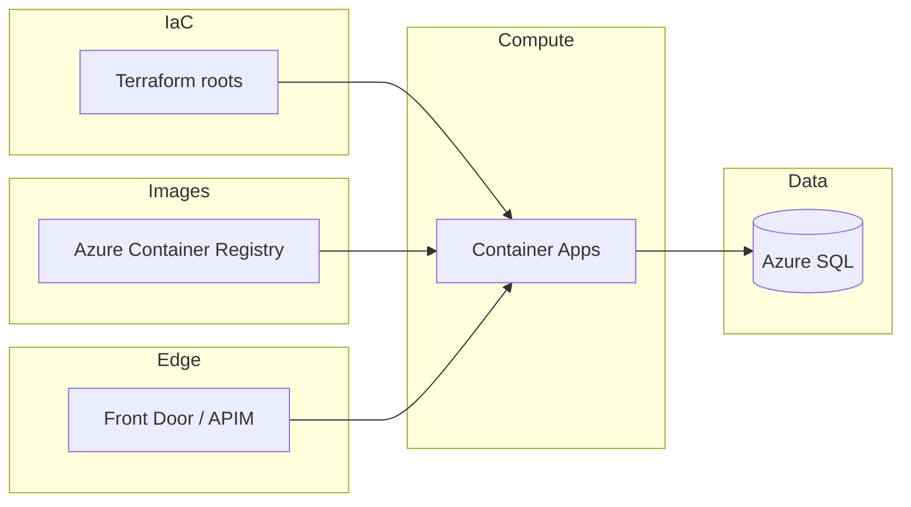
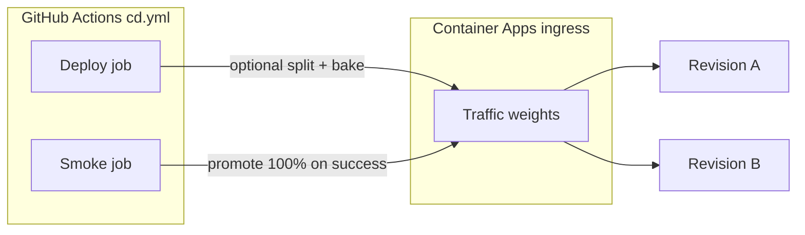

> **Scope:** Hosted SaaS deployment validation and promotion (Terraform + Container Apps + edge) for internal operators — staging verification through production promotion; does not replace root `README.md` files under `infra/terraform-*/` or org change control.

# Hosted deployment runbook (staging + production)

**Last reviewed:** 2026-07-20

**Audience:** Platform / release operators validating ArchLucid in Azure **staging** or promoting a validated release to **production**.

**Canonical references (do not duplicate their logic here):**

- Apply order and pilot vs multi-root: [`docs/library/REFERENCE_SAAS_STACK_ORDER.md`](../library/REFERENCE_SAAS_STACK_ORDER.md), [`docs/library/FIRST_AZURE_DEPLOYMENT.md`](../library/FIRST_AZURE_DEPLOYMENT.md), [`infra/README.md`](../../infra/README.md).
- Orchestration script: [`infra/apply-saas.ps1`](../../infra/apply-saas.ps1) (`-MultiRoot` = per-root state in dependency order; default without `-MultiRoot` is **`infra/terraform-pilot`** only — profile validation, **no** Azure resources).
- Container workloads module: [`infra/terraform-container-apps/`](../../infra/terraform-container-apps/).
- CD automation: [`.github/workflows/cd-staging-on-merge.yml`](../../.github/workflows/cd-staging-on-merge.yml) (optional auto-staging), [`.github/workflows/cd-saas-greenfield.yml`](../../.github/workflows/cd-saas-greenfield.yml) (**DRAFT** / `workflow_dispatch`), [`.github/workflows/cd.yml`](../../.github/workflows/cd.yml) + [`docs/library/DEPLOYMENT_CD_PIPELINE.md`](../library/DEPLOYMENT_CD_PIPELINE.md).
- DbUp / schema posture: [`docs/runbooks/MIGRATION_ROLLBACK.md`](./MIGRATION_ROLLBACK.md); migrations run from API startup via [`ArchLucid.Host.Core/Startup/ArchLucidPersistenceStartup.cs`](../../ArchLucid.Host.Core/Startup/ArchLucidPersistenceStartup.cs) (`DatabaseMigrator`).
- Failed deploy / rollback (on call): [`docs/library/DEPLOYMENT_RUNBOOK.md`](../library/DEPLOYMENT_RUNBOOK.md).
- Production config gates: `ArchLucidConfigurationRules` → `ProductionSafetyRules` + **`BillingProductionSafetyRules`** ([`ArchLucid.Host.Core/Startup/Validation/`](../../ArchLucid.Host.Core/Startup/Validation/)) — **Production** startup fails on unsafe billing/Marketplace/CORS settings.

**Naming:** This document intentionally avoids real subscription IDs, vault names, hostnames, and secret values. Substitute your environment’s values.

| Goal | Section |
|------|---------|
| Staging pre-deploy + validation | **Part A** |
| Production promotion | **Part B** |
| Canary traffic split (staging or production) | **Part C** |
| Rollback / fix-forward on failure | [`DEPLOYMENT_RUNBOOK.md`](../library/DEPLOYMENT_RUNBOOK.md) |

---

## Part A — Staging

**Objective:** Confirm the ArchLucid stack in Azure staging is safe to hand to pilot users: prerequisites satisfied, Terraform state matches intended resources, containers run current images, SQL is migrated, health checks pass, and (when required) one full architecture run can execute and commit.

**Assumptions:** Azure subscription access, Terraform backends and `tfvars` for staging, ACR push rights, and an API key (or Entra principal) that can call staging APIs.

### A.1 Pre-deploy verification (before `terraform apply` or CD)

Complete before first staging deploy or when re-baselining `staging.archlucid.net`.

#### Domain alignment

| Check | Command | Expected result |
|-------|---------|-----------------|
| No `archlucid.com` in non-archive source | `rg "archlucid\.com" --glob "*.{cs,ts,tsx,json,yml,yaml,ps1}" --glob "!**/archive/**" -l` | Only CloudEvents files (`com.archlucid.*` URIs) |
| No `archlucid.com` in active docs | `rg "archlucid\.com" docs/ --glob "!docs/archive/**" -l` | Only files containing `com.archlucid.*` CloudEvents URIs |
| `appsettings.json` BaseUrl | `ArchLucid.Api/appsettings.json` → `ArchLucid:PublicSite:BaseUrl` | `https://archlucid.net` |
| CLI staging URL | `ArchLucid.Cli/Commands/TrialSmokeCommandOptions.cs` → `StagingApiBaseUrl` | `https://staging.archlucid.net` |

#### Azure resource prerequisites

| Resource | Check command | Expected state |
|----------|---------------|----------------|
| **DEV subscription** | `az account show --subscription <DEV_SUB_ID>` | Active |
| **ACR** | `az acr show --name <registry> --query loginServer -o tsv` | Returns login server URL |
| **Entra app registrations** | Entra admin center → App registrations | API + UI registrations with redirect URIs for `https://staging.archlucid.net` |
| **DNS zone** | `nslookup staging.archlucid.net` | Resolves (CNAME to Front Door endpoint, or placeholder A record) |
| **SQL Server** | `az sql server list -g <rg> --query "[].name" -o tsv` | Server exists in DEV subscription |
| **Key Vault** | `az keyvault show --name <vault> --query "properties.vaultUri" -o tsv` | Returns vault URI |

#### Terraform validation (read-only)

```powershell
$roots = @(
    "infra/terraform-private",
    "infra/terraform-keyvault",
    "infra/terraform-sql-failover",
    "infra/terraform-storage",
    "infra/terraform-servicebus",
    "infra/terraform-entra",
    "infra/terraform-container-apps",
    "infra/terraform-edge",
    "infra/terraform-monitoring"
)

foreach ($root in $roots) {
    Write-Host "--- Validating $root ---"
    Push-Location $root
    terraform init -backend=false
    terraform validate
    Pop-Location
}
```

For a full plan: `cd infra/terraform-pilot` → `terraform init` → `terraform plan -out=staging.tfplan` (requires Azure credentials).

#### GitHub `staging` environment

See [`docs/deployment/STAGING_GITHUB_ENVIRONMENT_SETUP.md`](../deployment/STAGING_GITHUB_ENVIRONMENT_SETUP.md). Verify secrets exist (not values): `AZURE_CLIENT_ID`, `AZURE_TENANT_ID`, `AZURE_SUBSCRIPTION_ID`, `ACR_LOGIN_SERVER`, `AZURE_RESOURCE_GROUP`, `CONTAINER_APP_API_NAME`; variable `AUTO_DEPLOY_STAGING_MERGE` = `true` when using merge-to-staging CD; variable `ARCHLUCID_STAGING_BASE_URL` = `https://staging.archlucid.net`.

#### CORS and Entra (staging host)

| Configuration | Value |
|---------------|-------|
| Container App env | `Cors__AllowedOrigins__0=https://staging.archlucid.net` (or `cors_allowed_origins` in `infra/terraform-container-apps/variables.tf`) |
| Entra UI redirect URIs | `https://staging.archlucid.net/auth/callback`, `https://staging.archlucid.net/api/auth/callback/azure-ad` (if using NextAuth) |

`BillingProductionSafetyRules` and `ArchLucidConfigurationRules` require non-empty, non-wildcard origins after deploy.

### A.2 Staging deployment checklist

#### Default Terraform apply order

Apply nested stacks per [`REFERENCE_SAAS_STACK_ORDER.md`](../library/REFERENCE_SAAS_STACK_ORDER.md). Staging-relevant roots:

| Order (multi-root) | Root | Role for staging |
|-------------------|------|------------------|
| 1–5 | `infra/terraform-private` … `infra/terraform-storage` | Network, Key Vault, SQL, storage — **foundation** |
| 5–6 | `infra/terraform-servicebus`, `infra/terraform-logicapps` | Optional messaging / trial email |
| 8 | `infra/terraform-entra` | App registrations and consent (API + UI) |
| 9 | `infra/terraform-container-apps` | **API + Worker + UI** Container Apps |
| 10 | `infra/terraform-edge` | **Azure Front Door** / WAF |
| 12+ | `infra/terraform-monitoring` | Observability |

**Convenience:** `infra/apply-saas.ps1 -MultiRoot` or `infra/terraform-pilot` (guidance only — no resources). Verify three workloads in `infra/terraform-container-apps/main.tf`: `azurerm_container_app.api`, `.worker`, `.ui`.



#### Merge-to-staging CD (optional)

[`.github/workflows/cd-staging-on-merge.yml`](../../.github/workflows/cd-staging-on-merge.yml) runs when **`AUTO_DEPLOY_STAGING_MERGE=true`**, CI succeeded on push to `main`/`master`, and the `staging` GitHub environment is configured ([`DEPLOYMENT_CD_PIPELINE.md`](../library/DEPLOYMENT_CD_PIPELINE.md)).

| Prerequisite | Verification |
|-------------|--------------|
| ACR build/push | `ACR_LOGIN_SERVER` set; after deploy: `az acr repository show-tags --name <registry> --repository archlucid-api` |
| Container app update | `AZURE_RESOURCE_GROUP`, `CONTAINER_APP_API_NAME` set; worker uses same API image tag; UI uses `archlucid-ui:<tag>` |
| Post-deploy smoke | `SMOKE_TEST_BASE_URL` set to public API base for [`scripts/ci/cd-post-deploy-verify.sh`](../../scripts/ci/cd-post-deploy-verify.sh) |

**Manual alternative:** [`.github/workflows/cd.yml`](../../.github/workflows/cd.yml) with target `staging`.

#### Container Apps images (Terraform vs CD)

| Source | What to verify |
|--------|----------------|
| `infra/terraform-container-apps` | **TB-657:** `lifecycle { ignore_changes = [template[0].container[0].image] }` — CD owns live tags; `terraform plan` should show **no** image delta after CD roll |
| CD workflows | `az containerapp update --image` updates revisions |

#### Front Door and `staging.archlucid.net`

| Prerequisite | Verification |
|--------------|--------------|
| Front Door profile / route | `infra/terraform-edge` — origin `host_name` = Container App hostname |
| Custom domain | CNAME `staging.archlucid.net` → Front Door endpoint; managed certificate valid |
| API routes | `curl -fsS https://staging.archlucid.net/health/live` and `/health/ready` → **200** |

#### SQL, Key Vault, Entra, Service Bus

| Prerequisite | Verification |
|--------------|--------------|
| SQL + `ConnectionStrings:ArchLucid` | `/health/ready` — database dependency healthy |
| `ArchLucid:StorageProvider=Sql` | [ADR 0011](../architecture/adrs/0011-inmemory-vs-sql-storage-provider.md); readiness JSON |
| Key Vault | Secret names populated — **no values in repo** |
| Service Bus (optional) | If enabled: namespace exists; if not used, `BackgroundJobs:Mode` must not require missing bus |

#### Demo seed and trial funnel

| Topic | Fact |
|-------|------|
| **Hosted staging** | `Demo:SeedOnStartup` runs only when `app.Environment.IsDevelopment()` — **not** the mechanism for public staging |
| **Trial funnel** | Self-serve sample run via signup/coordinator flows — [`TRIAL_AND_SIGNUP.md`](../go-to-market/TRIAL_AND_SIGNUP.md), [`TRIAL_FUNNEL.md`](./TRIAL_FUNNEL.md), E2E [`live-api-trial-signup.spec.ts`](../../archlucid-ui/e2e/live-api-trial-signup.spec.ts) |

#### Hosted probes (`ARCHLUCID_STAGING_BASE_URL`)

[`hosted-saas-probe.yml`](../../.github/workflows/hosted-saas-probe.yml) uses repository variable **`ARCHLUCID_STAGING_BASE_URL`** (public HTTPS API origin, no trailing slash). If unset, workflow exits **0** and skips — no signal. Verify: `curl -fsS "${ARCHLUCID_STAGING_BASE_URL}/health/live"` and `/health/ready`.

### A.3 Post-deploy validation

| Step | Verification |
|------|----------------|
| Container image | New digest on staging ACR; revision references it |
| DbUp / migrations | `ArchLucid.Persistence` scripts applied; journal current |
| Secrets | AOAI keys, connection strings in Key Vault / ACA secrets |
| Identity | Managed identities have RBAC on SQL, storage, AOAI |
| DNS / TLS | Public hostname matches Front Door / custom domain config |

#### Authority pipeline (Durable Task)

**Security:** Durable Task **gRPC endpoint** and SQL catalog on **private** paths only. Store **`ArchLucid:AuthorityPipeline:DurableTask:GrpcEndpoint`** in Key Vault / ACA secrets.

**Validate SQL + DTF together:**

1. Set **`ArchLucid__AuthorityPipeline__DurableTask__GrpcEndpoint`** to the reachable worker/scheduler address.
2. Set **`ARCHLUCID_SMOKE_SQL`** (or **`ConnectionStrings__ArchLucid`**) to a tenant catalog under test.
3. From repo root: **`.\scripts\release-smoke.ps1 -AuthorityPipelineDtfSmoke`** (omit **`-SkipE2E`**).

**Rollback:** Revision rollback (Container Apps) or Terraform apply of previous image/env — not a runtime toggle back to Legacy on SQL hosts. See [`DEPLOYMENT_RUNBOOK.md`](../library/DEPLOYMENT_RUNBOOK.md).

#### Observability and alerts

| Step | Verification |
|------|----------------|
| Metrics | After one execute, confirm `archlucid_agent_output_*` / `archlucid_authority_*` in App Insights or OTLP ([`OBSERVABILITY.md`](../library/OBSERVABILITY.md)) |
| Alerts | Test action group fires on synthetic failure in non-production rule |

**Security:** Private SQL/storage; never expose SMB (port 445) publicly. API keys and JWTs scoped; smoke scripts read keys from environment only.

### A.4 Staging smoke tests

**Automated (full request lifecycle):**

```bash
export ARCHLUCID_BASE_URL="https://your-staging-api.example.com"
export ARCHLUCID_API_KEY="..."   # if required
./scripts/staging-smoke.sh
```

PowerShell: `.\scripts\staging-smoke.ps1` with `$env:ARCHLUCID_BASE_URL` / `$env:ARCHLUCID_API_KEY`.

**What it does:** `/health/live`, `/health/ready`, `/version`; then request → execute → poll → commit → manifest. Writes **`staging-smoke-results.json`** (`STAGING_SMOKE_RESULTS_FILE` to override).

**One-page operator smoke (after deploy):**

1. `curl -fsS https://staging.archlucid.net/health/live` → **200**
2. `curl -fsS https://staging.archlucid.net/health/ready` → **200**, top-level **Healthy**
3. Open `/signup` — page renders; auth flow works
4. Optional: `dotnet run --project ArchLucid.Cli -- trial smoke --staging --org "Smoke Test" --email "smoke@example.com"`

**Richer evidence:** `dotnet run --project ArchLucid.Cli -- deployment-evidence --environment staging --api-base-url "$SMOKE_TEST_BASE_URL" …` ([`DEPLOYMENT_CD_PIPELINE.md`](../library/DEPLOYMENT_CD_PIPELINE.md)).

### A.5 Staging trial funnel validation (pre-RC sign-off)

**Audience:** Pre-release validation. Run against `https://staging.archlucid.net` before marking a release candidate production-ready.

**Companion docs (architecture and automation):** [`TRIAL_FUNNEL_END_TO_END.md`](./TRIAL_FUNNEL_END_TO_END.md) (code/audit map), [`TRIAL_END_TO_END.md`](./TRIAL_END_TO_END.md) (Playwright live suite), [`TRIAL_FUNNEL.md`](./TRIAL_FUNNEL.md) (Prometheus observability).

#### Prerequisites

| Requirement | How to verify |
|-------------|--------------|
| Staging API is healthy | `Invoke-RestMethod https://staging.archlucid.net/health/ready` returns `Healthy` |
| Staging UI loads | Browser navigates to `https://staging.archlucid.net` without errors |
| DNS resolves | `nslookup staging.archlucid.net` returns expected Front Door CNAME |
| TLS certificate valid | Browser padlock shows valid certificate (not self-signed, not expired) |
| Billing provider configured | Staging uses `Billing:Provider=Noop` or Stripe TEST keys (**never** live keys on staging) |

#### Phase 1: Landing and signup (anonymous)

| # | Step | Expected | Pass |
|---|------|----------|------|
| 1.1 | Navigate to `https://staging.archlucid.net` | Marketing home page loads; no console errors | [ ] |
| 1.2 | Click **Sign up** / navigate to `/signup` | Signup form renders with email, name, and organization fields | [ ] |
| 1.3 | Submit signup form with a test email | Registration succeeds; redirected to verification or operator home (depending on auth mode) | [ ] |
| 1.4 | Verify email (if `Auth:Trial:Modes=LocalIdentity`) | Verification page accepts the code; session is established | [ ] |
| 1.5 | After auth, operator home page loads | Home page renders; trial banner is visible; sample run link is present | [ ] |

#### Phase 2: Sample run experience (first-value path)

| # | Step | Expected | Pass |
|---|------|----------|------|
| 2.1 | Click sample run link from home page | Run detail page loads with simulator-generated results | [ ] |
| 2.2 | Click **Finalize** / commit the sample run | Commit succeeds; manifest is generated; version badge appears | [ ] |
| 2.3 | Navigate to manifest view | Manifest renders with decisions, findings, and metadata sections | [ ] |
| 2.4 | Download DOCX artifact | DOCX file downloads; opens in Word/LibreOffice without corruption | [ ] |

#### Phase 3: Operator flow (new review)

| # | Step | Expected | Pass |
|---|------|----------|------|
| 3.1 | Navigate to `/architecture/reviews/new` | New **review** wizard renders (retired bookmark); contextual help info icon is present | [ ] |
| 3.2 | Submit an architecture request (use a template or free-text) | Review session is created (**`runId`** in API); pipeline status page shows agent tasks | [ ] |
| 3.3 | Wait for agent execution (simulator: < 10s) | All agent tasks complete; green status indicators | [ ] |
| 3.4 | Finalize the review | Commit succeeds; manifest version increments | [ ] |

#### Phase 4: Trial metering and limits

| # | Step | Expected | Pass |
|---|------|----------|------|
| 4.1 | Create runs until trial write limit is reached | API returns `402 Payment Required` with `application/problem+json` body | [ ] |
| 4.2 | Verify trial banner shows upgrade CTA | Banner text includes "upgrade" or "subscribe" language | [ ] |

#### Phase 5: Checkout and conversion (Noop / Stripe TEST)

| # | Step | Expected | Pass |
|---|------|----------|------|
| 5.1 | Click upgrade CTA | Checkout URL is returned (Noop: immediate; Stripe TEST: redirects to Stripe test checkout) | [ ] |
| 5.2 | Complete checkout (Noop: automatic; Stripe: use test card `4242...`) | Trial status transitions to `Converted` | [ ] |
| 5.3 | Verify trial banner is hidden after conversion | No trial/upgrade banner on home page | [ ] |
| 5.4 | Verify write limits are lifted | New runs can be created without `402` | [ ] |

#### Phase 6: Observability and audit

| # | Step | Expected | Pass |
|---|------|----------|------|
| 6.1 | Check `/v1/audit` for `TrialProvisioned` event | Event exists with correct `TenantId` and timestamp | [ ] |
| 6.2 | Check Prometheus metrics (if available) | `archlucid_trial_registrations_total` counter incremented | [ ] |
| 6.3 | Check Application Insights (if configured) | Request telemetry shows signup and commit traces | [ ] |

#### Phase 7: Security and edge cases

| # | Step | Expected | Pass |
|---|------|----------|------|
| 7.1 | Attempt signup with an already-registered email | API returns appropriate error (conflict or idempotent success) | [ ] |
| 7.2 | Attempt to access operator routes without auth | Redirect to signin page; no data leakage | [ ] |
| 7.3 | Verify CORS headers | API responses include correct `Access-Control-Allow-Origin` for staging UI origin | [ ] |
| 7.4 | Verify rate limiting | Rapid-fire registration requests eventually return `429 Too Many Requests` | [ ] |

#### Automated validation

```powershell
$env:LIVE_E2E_API_BASE_URL = "https://staging.archlucid.net"
$env:LIVE_E2E_HARNESS_SECRET = "<staging-harness-secret>"
cd archlucid-ui
npx playwright test live-api-trial-end-to-end.spec.ts
```

The CI workflow `ui-e2e-live.yml` runs this suite as part of the staging deployment pipeline.

#### Sign-off

| Role | Name | Date | Result |
|------|------|------|--------|
| Engineering | | | |
| Product | | | |
| Security | | | |

**Notes:** Covers the **buyer/prospect** path only — internal operator onboarding (Docker, .NET SDK) uses `scripts/release-smoke.ps1`. Clean up test tenants per [`TRIAL_END_TO_END.md`](./TRIAL_END_TO_END.md#cleaning-up-test-tenants).

### A.6 Staging execution order

When §A.1 checks are green:

1. Apply Terraform roots per [`REFERENCE_SAAS_STACK_ORDER.md`](../library/REFERENCE_SAAS_STACK_ORDER.md)
2. Build and push Docker images to ACR (or let CD do this)
3. Update Container App revisions (API, worker, UI)
4. Run §A.4 smoke tests
5. Run §A.5 trial funnel validation before RC sign-off
6. Set `ARCHLUCID_STAGING_BASE_URL` if not already set
7. Optionally trigger `hosted-saas-probe.yml` manually

---

## Part B — Production promotion

Complete **Part A** on staging (or equivalent evidence) before production cutover unless an emergency hotfix process explicitly waives it.

### B.1 Pre-flight checks

| # | Check | Verify | Min. Azure RBAC (typical) | Owner-only (O) vs Automatable (A) |
|---|--------|--------|---------------------------|-------------------------------------|
| B.1.1 | **Subscription & tenant** — correct Entra tenant and deployment subscription (`az account show`). | Identity matches change ticket. | *Reader* at deployment scope. | O: subscription selection; A: `az account set`. |
| B.1.2 | **Git / artifact** — image tags in `terraform-container-apps` tfvars exist in ACR. | `az acr repository show-tags` shows tag; digests immutable. | *AcrPull* / *Reader* on ACR. | A: CI build-push; O: non-standard tags. |
| B.1.3 | **Key Vault & secrets** — connection strings, OIDC secrets, Stripe/Marketplace config, webhook HMAC, **`Cors:AllowedOrigins`**. | Required secret names populated; API MI can resolve at runtime. | *Key Vault Secrets User* (get). | **O:** live payment keys; **A:** templated pipelines. |
| B.1.4 | **DNS** — public zones/delegation; private DNS links for private endpoints. | `nslookup` / resolver correct; private zone linked per `terraform-private` README. | *DNS Zone Contributor* / *Private DNS Zone Contributor*. | **O:** registrar; **A:** Terraform records. |
| B.1.5 | **Terraform remote state** — backend exists; **unique state key per root**. | `terraform init` succeeds per `infra/terraform-*` root. | *Storage Blob Data Contributor* on tfstate. | **O:** bootstrap; **A:** routine init/plan/apply. |
| B.1.6 | **Billing production safety** — satisfies **`BillingProductionSafetyRules`** before production traffic ([`BILLING.md`](../library/BILLING.md)). | Config lint / staging slot passes; production KV/ACA matches rules. | Same as secrets writers. | **O:** enable live commerce; **A:** secret injection. |
| B.1.7 | **GitHub `production` environment** — protection rules, OIDC credentials, CD secrets. | Dry-run or greenfield validation job pattern succeeds. | Federated credential on app registration; GitHub env admin. | **O:** org admin; **A:** routine deploy. |

### B.2 Terraform plan review

From repo root: **`infra/apply-saas.ps1`** without `-Apply` (default = plan). Full stack: **`-MultiRoot`**. Review each root’s plan (no unexpected destroys); save artifacts per org policy.

**RBAC:** *Contributor* on target RGs (or custom deployer role) for plan + apply.

### B.3 Terraform apply sequence

Layers map to [`REFERENCE_SAAS_STACK_ORDER.md`](../library/REFERENCE_SAAS_STACK_ORDER.md) — what [`infra/apply-saas.ps1 -MultiRoot -Apply`](../../infra/apply-saas.ps1) follows:

1. `infra/terraform-private` — VNet, private endpoints, DNS
2. `infra/terraform-keyvault`
3. `infra/terraform-sql-failover`
4. `infra/terraform-storage`, `terraform-servicebus`, `terraform-logicapps`, `terraform-openai` as enabled
5. `infra/terraform-entra`
6. `infra/terraform-container-apps` — API, worker, UI
7. `infra/terraform-edge` — Front Door / WAF
8. `infra/terraform` — optional APIM consumption
9. `infra/terraform-monitoring`
10. `infra/terraform-orchestrator` if used

**Execute:** `.\infra\apply-saas.ps1 -MultiRoot -Apply` after plan review, or frozen `terraform apply tfplan` per [`FIRST_AZURE_DEPLOYMENT.md`](../library/FIRST_AZURE_DEPLOYMENT.md).

### B.4 Post-Terraform validation

| Step | Action | Verify |
|------|--------|--------|
| B.4.1 | Probe API ingress | `GET /health/live` **200** |
| B.4.2 | Readiness | `GET /health/ready` **200**, JSON **Healthy** ([`DEPLOYMENT_CD_PIPELINE.md`](../library/DEPLOYMENT_CD_PIPELINE.md)) |
| B.4.3 | Build identity | `GET /version` **200** |
| B.4.4 | Production safety rules | API starts with `ASPNETCORE_ENVIRONMENT=Production`; no config validation fatals in logs ([`DEPLOYMENT.md`](../engineering/DEPLOYMENT.md)) |

### B.5 Database migration verification (DbUp)

| Step | Verify |
|------|--------|
| B.5.1 | **`SchemaVersions`** journal present; latest script id matches build ([`MIGRATION_ROLLBACK.md`](./MIGRATION_ROLLBACK.md)) |
| B.5.2 | `archlucid doctor --api <base>` — no schema-version defects |
| B.5.3 | **System + tenant topology:** repeat for system and pilot tenant catalogs when `SqlTopology:Mode=SystemWithPerTenantCatalogs` |

Rolling-deploy migration patterns: [`MIGRATION_ROLLBACK.md`](./MIGRATION_ROLLBACK.md#rolling-deploy-migrations).

### B.6 Smoke test (production base URL)

[`scripts/release-smoke.ps1`](../../scripts/release-smoke.ps1) starts a **local** API — it does **not** replace hosted production probes ([`RELEASE_SMOKE.md`](../library/RELEASE_SMOKE.md)).

| Step | Action | Verify |
|------|--------|--------|
| B.6.1 | `bash scripts/ci/cd-post-deploy-verify.sh https://<api-host>` | Exit **0**; `/health/ready` Healthy |
| B.6.2 | `archlucid doctor --api https://<api-host>` | Exit **0** |
| B.6.3 | `archlucid deployment-evidence --environment production --api-base-url https://<api-host> …` | Exit **0** |
| B.6.4 | Optional: `.\scripts\release-smoke.ps1 -SkipE2E` before promotion | Local build/tests only — use B.6.1–B.6.3 for prod URL |

### B.7 DNS cutover and Front Door verification

| Step | Action | Verify |
|------|--------|--------|
| B.7.1 | `infra/terraform-edge` outputs published | Hostname resolves to Front Door; TLS valid |
| B.7.2 | Gradual cutover (lower TTL first) | Public `GET /health/live` **200** |
| B.7.3 | WAF / rate limits | Negative probe blocked; legitimate API `POST` succeeds |

### B.8 Post-deployment monitoring (first ~30 minutes)

| Timebox | Check |
|---------|--------|
| T+0–5m | No unexpected alert storms; ACA replica count stable; no 5xx surge on edge |
| T+5–15m | SQL DTU/connections normal; no DbUp errors in API logs |
| T+15–30m | Trial/billing canary in safe mode; escalate per [`INFRASTRUCTURE_OPS.md`](./INFRASTRUCTURE_OPS.md) if anomaly |

### B.9 Rollback

**Do not roll back from this checklist** — use [`docs/library/DEPLOYMENT_RUNBOOK.md`](../library/DEPLOYMENT_RUNBOOK.md) (Container Apps revision rollback, CD manual rollback, Terraform/state cautions, SQL PITR).

---

## Part C — Canary promotion (Container Apps)

**Objective:** Run **revision-based** rollouts for API / worker / UI on Azure Container Apps using Terraform revision mode, GitHub Actions CD, and optional traffic splits before full promotion.

**Assumptions:** Apps deployed from `infra/terraform-container-apps/` with `enable_container_apps = true`. CD uses [`.github/workflows/cd.yml`](../../.github/workflows/cd.yml).

**Constraints:**

- **`api_revision_mode = Multiple`** (Terraform) required before `az containerapp ingress traffic set` can weight multiple revisions.
- Keep **`SMOKE_TEST_BASE_URL`** set whenever **`CD_CANARY_ENABLED=true`** so bake and promotion align.



### C.1 Terraform (one-time or change window)

1. Set `api_revision_mode = "Multiple"` (and optionally worker/ui) in tfvars; `terraform apply`.
2. Confirm: `az containerapp show -g RG -n API --query "properties.configuration.ingress.traffic"`.

Audit repo vars: `.\scripts\ci\verify-cd-canary-vars.ps1` ([`GITHUB_CD_ENVIRONMENTS.md`](../operations/GITHUB_CD_ENVIRONMENTS.md)).

### C.2 CD automation

| Variable | Purpose |
|----------|---------|
| `CD_CANARY_ENABLED` | `true` = split + bake + promote (default off) |
| `CD_CANARY_INITIAL_PERCENT` | Weight for **new** revision (1–99; default **10**) |
| `CD_CANARY_BAKE_MINUTES` | Sleep after split before smoke (default **0**) |

**Flow in `cd.yml`:**

1. Deploy job records API revision before/after `az containerapp update`.
2. If canary enabled and revisions differ: `az containerapp ingress traffic set` with `(100-PCT)%` old / `PCT%` new; optional bake sleep.
3. Smoke job runs `cd-post-deploy-verify.sh` against `SMOKE_TEST_BASE_URL`.
4. On success: smoke job sets **100%** on new revision.

**Failed smoke:** optional **`CD_ROLLBACK_ON_SMOKE_FAILURE`** deactivates bad revision — see [`DEPLOYMENT_RUNBOOK.md`](../library/DEPLOYMENT_RUNBOOK.md) §4.

### C.3 Manual break-glass

```bash
az containerapp revision list -g RG -n APP --all
az containerapp ingress traffic set -g RG -n APP --revision-weight REV-STABLE=90 --revision-weight REV-CANARY=10
```

Promote by shifting to 100% on the new revision; deactivate old revision after observation.

**Cost / cold start:** Two active revisions during canary is normal; does not require raising `min_replicas` (TB-755). See [`COLD_START_MEASUREMENT.md`](./COLD_START_MEASUREMENT.md) if users see brief 502/503 during bake.

---

## Related

- Umbrella: [`docs/engineering/DEPLOYMENT.md`](../engineering/DEPLOYMENT.md)
- Ops context: [`docs/runbooks/INFRASTRUCTURE_OPS.md`](./INFRASTRUCTURE_OPS.md)
- Staging GitHub setup: [`docs/deployment/STAGING_GITHUB_ENVIRONMENT_SETUP.md`](../deployment/STAGING_GITHUB_ENVIRONMENT_SETUP.md)
- Trial funnel map: [`docs/runbooks/TRIAL_FUNNEL_END_TO_END.md`](./TRIAL_FUNNEL_END_TO_END.md)
- Trial product design: [`docs/go-to-market/TRIAL_AND_SIGNUP.md`](../go-to-market/TRIAL_AND_SIGNUP.md)
- Former paths: [`docs/redirects.md`](../redirects.md)
