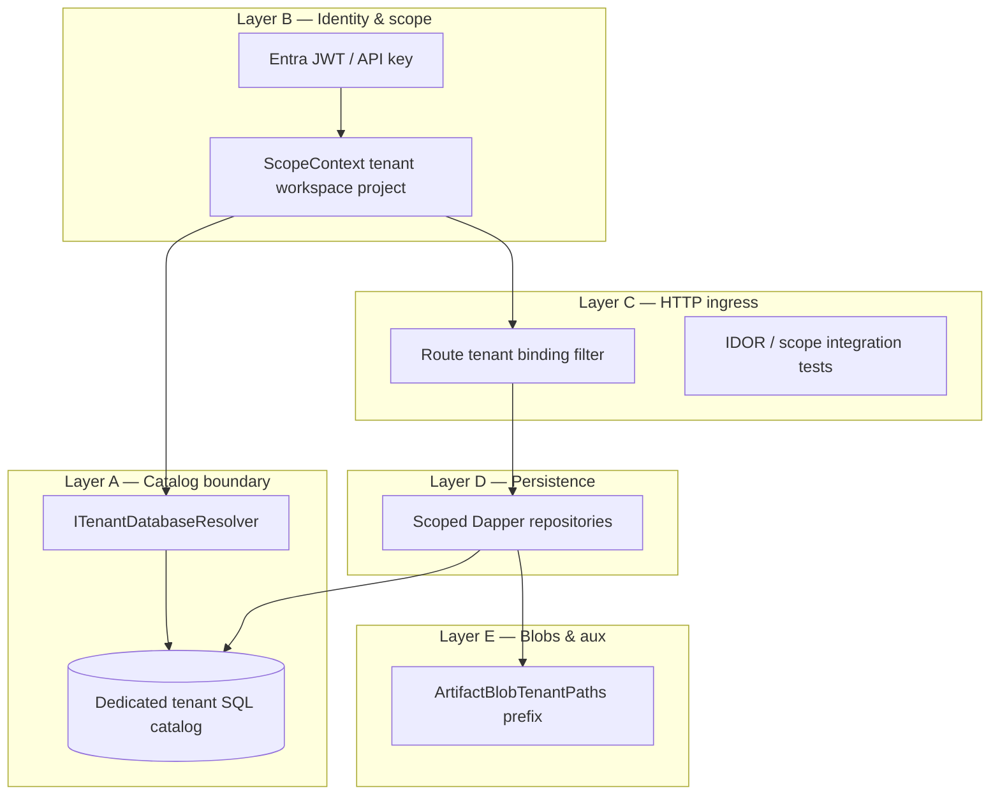

> **Scope:** Normative tenant isolation model for production — **no SQL RLS**. Do not cite RLS as a deployed control without [ADR 0037](../architecture/adrs/0037-tenant-isolation-without-rls-defense-in-depth.md).

> **Spine doc:** [`START_HERE.md`](../START_HERE.md).

# Tenant isolation — defense in depth (without RLS)

**Status:** Accepted per [ADR 0037](../architecture/adrs/0037-tenant-isolation-without-rls-defense-in-depth.md) (2026-06-06).

**Audience:** Engineers, security reviewers, architecture assessments, coding agents.

## Decision summary

| Question | Answer |
|----------|--------|
| Is SQL RLS required in production? | **No.** Removed by migration 148; do not reinstate without a new ADR. |
| What is the primary isolation mechanism? | **Database-per-tenant** (`SystemWithPerTenantCatalogs`) + connection routing. |
| What if app code omits `TenantId` in SQL? | Within a tenant catalog, wrong rows may leak **workspace/project** scope — not cross-tenant catalogs when routing is correct. |
| Is `SingleCatalog` allowed in prod? | **No** — startup fail-fast in production-like hosts. |

## Layer model

### Layer A — Catalog boundary (primary)

- **Config:** `ArchLucid:SqlTopology:Mode=SystemWithPerTenantCatalogs`
- **Routing:** `ScopedRoutingSqlConnectionFactory`, `ITenantDatabaseResolver`, `TenantDatabaseBindings`
- **Guard:** `ProductionSafetyRules.CollectSingleCatalogDisallowedInProductionLike`
- **Docs:** [`TENANT_DATABASE_TOPOLOGY.md`](../library/TENANT_DATABASE_TOPOLOGY.md), [`TENANT_SQL_TOPOLOGY_RUNBOOK.md`](../runbooks/TENANT_SQL_TOPOLOGY_RUNBOOK.md)

### Layer B — Identity and typed scope

- Scope derived **once** at host boundary; deeper layers use `IScopeContextProvider` / method parameters — not raw `HttpContext` (see **ARCH001** `TenantIdentityBoundaryAnalyzer`).
- **Invariant:** [INV-001](../library/ARCHITECTURE_INVARIANTS.md#inv-001-tenant-identity-boundary)
- **Fail-closed derivation (TB-304 / ADR 0041):** On production-like hosts, `ScopeResolutionGuardMiddleware` rejects requests whose tenant/workspace/project scope is not bound to **identity claims** or an explicit **ambient job override**. Header-only and `ScopeIds.Default*` resolution return **403** unless the route is marked `[AllowUnscopedRoute]`.

#### Trusted scope sources (production-like)

| Source | Trusted? | Notes |
|--------|----------|-------|
| JWT / API-key `tenant_id`, `workspace_id`, `project_id` claims | Yes | Primary production binding |
| `AmbientScopeContext` override | Yes | Background jobs; must not use `ScopeIds.Default*` |
| `x-tenant-id` / `x-workspace-id` / `x-project-id` headers | **No** | Rejected on production-like (claims win when both present) |
| `ScopeIds.Default*` fallback | **No** | Development/CI only |

#### Allow-list contract

- **`[AllowUnscopedRoute]`** — marketing, registration, webhooks, version probe, and other legitimately scope-free controllers/actions.
- **`/internal/*` path skip** — documented fallback for operator diagnostics (still require operator auth).
- **Health / OpenAPI minimal routes** — skipped by path prefix in middleware.

- Startup: `ProductionSafetyRules.CollectScopeDerivationUnsafeInProductionLike` rejects `DevelopmentBypass` auth mode and `AllowTestActorHeaders` on production-like hosts.

### Layer C — HTTP ingress

- `{tenantId}` route binding: `RouteTenantScopeBindingFilter`
- CI: `scripts/ci/assert_route_tenant_scope_guard.py`
- Integration: `ArchLucid.Api.Tests/Security/TenantIsolationSmokeTests.cs`, route-tenant P1 batches

### Layer D — Persistence

- Repositories take `ScopeContext` or explicit `tenantId` parameters; tenant-scoped tables listed in [`TENANT_SCOPED_TABLES_INVENTORY.md`](../library/TENANT_SCOPED_TABLES_INVENTORY.md)
- SQL integration tests: `*ScopeIsolationSqlIntegrationTests` under `ArchLucid.Persistence.Tests`

### Layer E — Blob and auxiliary stores

- `ArtifactBlobTenantPaths` — tenant prefix on blob keys
- Vector index / Cosmos: tenant id on queries and writes (see retrieval architecture tests)

### Layer F — Platform cross-tenant (explicit exception)

- Cross-tenant rollups and internal analytics: **`PlatformCrossTenantReadAuthority`** / **`PlatformOperator`** only
- Not a substitute for product-path isolation; documented in [`INTERNAL_CROSS_TENANT_ANALYTICS.md`](../runbooks/INTERNAL_CROSS_TENANT_ANALYTICS.md)

## Explicit non-controls

- **`SESSION_CONTEXT` + RLS** — historical; see [`MULTI_TENANT_RLS.md`](MULTI_TENANT_RLS.md) for legacy design only
- **`RlsSessionContextInfrastructureHealthCheck`** — probes deprecated `TenantId` key; not evidence of active RLS
- **`SqlRowLevelSecurityBypassAmbient`** — legacy break-glass; irrelevant when RLS policies absent

## Architecture review checklist

When scoring tenant isolation **do not** ask “is RLS enabled?” Instead verify:

1. Production topology is `SystemWithPerTenantCatalogs` (config + startup rules).
2. Binding provisioning marks tenants active only after catalog migrate + mirror.
3. Route-tenant and IDOR tests pass; ARCH001 analyzer enabled on product assemblies.
4. No product code path uses system catalog connection for tenant-scoped reads without explicit design.
5. Cross-tenant admin endpoints require platform operator authority.

## Related ADRs and migrations

- [ADR 0037](../architecture/adrs/0037-tenant-isolation-without-rls-defense-in-depth.md) — **current decision**
- [ADR 0003](../architecture/adrs/0003-sql-rls-session-context.md) — **superseded** (historical)
- `148_RemoveRowLevelSecurity.sql` — DDL removal
