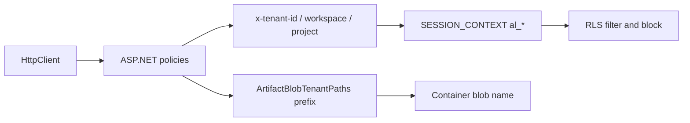

> **Scope:** Concrete tenant-isolation enforcement in code (RLS, policies, blob paths, tests) for engineers; not a full threat-model paper or customer-facing trust narrative.

# Tenant isolation — implementation notes (2026-04)

This doc ties code changes to the tenant-isolation threat model: what was enforced in SQL, HTTP, blob paths, and tests.

## SQL (RLS)

- **Parity guard:** [RlsTenantScopePolicyParityIntegrationTests.cs](../../ArchLucid.Persistence.Tests/RlsTenantScopePolicyParityIntegrationTests.cs) compares `sys.security_predicates` targets for `ArchiforgeTenantScope` vs `ArchLucidTenantScope` when both policies exist; post–migration 108 only `ArchLucidTenantScope` remains, and the test still asserts it is non-empty.
- **DDL guard:** [TenantScopedTableDdlTests.cs](../../ArchLucid.Architecture.Tests/TenantScopedTableDdlTests.cs) was extended for `ContextSnapshots`, `GoldenManifests` blob URI column, `ScimUsers` (tenant-only), and documents that `AgentExecutionTraces` has no denormalized triple-scope columns (isolation via `RunId`).

## HTTP authorization

- **Support bundle:** [SupportBundleController.cs](../../ArchLucid.Api/Controllers/Admin/SupportBundleController.cs) now requires `AdminAuthority` (tenant/workspace admin personas via `WorkspaceAdmin` + `Admin` roles).
- **Named roles:** [ArchLucidRoles.cs](../../ArchLucid.Core/Authorization/ArchLucidRoles.cs) adds `Architect`, `Reviewer`, `WorkspaceAdmin`; policies and [ArchLucidRoleClaimsTransformation.cs](../../ArchLucid.Api/Auth/Services/ArchLucidRoleClaimsTransformation.cs) map them to permission claims (Reviewer omits `commit:run`).

## Audit scope backfill

- [AuditService.cs](../../ArchLucid.Host.Core/Auth/Services/AuditService.cs) fills `TenantId` / `WorkspaceId` / `ProjectId` from `IScopeContextProvider` only when those values are still `Guid.Empty`, so explicit cross-scope audit payloads can be preserved when needed.

## Blob paths (artifact offload)

- [ArtifactBlobTenantPaths.cs](../../ArchLucid.Persistence/BlobStore/ArtifactBlobTenantPaths.cs): `FormatArtifactContentRelativePath` builds `{workspace}/{project}/artifacts/{manifestId}/{artifactId}/{fileName}`; [SqlArtifactBundleRepository.cs](../../ArchLucid.Persistence/Repositories/SqlArtifactBundleRepository.cs) uses it for large artifact content offload. `PrefixWithTenant` allows workspace-first logical paths so the final object key is `{tenant}/…`. The type lives in **ArchLucid.Persistence** (shared by **ArchLucid.Persistence.Runtime** blob stores) so SQL repositories can reference it without a **Persistence ↔ Persistence.Runtime** circular project reference.

## Integration tests

- [TenantIsolationSmokeTests.cs](../../ArchLucid.Api.Tests/Security/TenantIsolationSmokeTests.cs): ROI 404, artifact manifest 404 when a manifest exists for tenant A, and admin archive-batch from tenant A does not archive tenant B’s runs.

## Diagram (nodes / edges)

