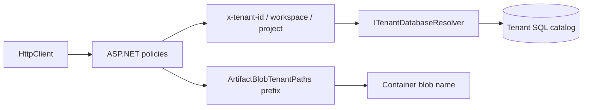

> **Scope:** Concrete tenant-isolation enforcement in code for engineers; aligned with [ADR 0037](../architecture/adrs/0037-tenant-isolation-without-rls-defense-in-depth.md) (no SQL RLS in production).

# Tenant isolation — implementation notes (2026-06)

This doc ties code changes to the tenant-isolation model. **Canonical layers:** [`TENANT_ISOLATION_DEFENSE_IN_DEPTH.md`](TENANT_ISOLATION_DEFENSE_IN_DEPTH.md).

## Layer A — Catalog boundary

- **Topology:** `SqlTopologyMode.SystemWithPerTenantCatalogs` in production-like hosts; `ProductionSafetyRules.CollectSingleCatalogDisallowedInProductionLike` blocks `SingleCatalog`.
- **Routing:** `ScopedRoutingSqlConnectionFactory`, `ITenantDatabaseResolver`, `TenantDatabaseBindings`.
- **Migration:** `148_RemoveRowLevelSecurity.sql` — RLS policies removed; do not re-add without a new ADR.

## Layer B — Typed scope

- **Analyzer:** `TenantIdentityBoundaryAnalyzer` (ARCH001) — bans `HttpContext` / `ClaimsPrincipal` below API/Host boundary in product assemblies.
- **Audit backfill:** [AuditService.cs](../../ArchLucid.Host.Core/Auth/Services/AuditService.cs) fills scope from `IScopeContextProvider` when audit payloads omit tenant/workspace/project.

## Layer C — HTTP authorization

- **Route binding:** `RouteTenantScopeBindingFilter` + CI `assert_route_tenant_scope_guard.py`.
- **Support bundle:** [SupportBundleController.cs](../../ArchLucid.Api/Controllers/Admin/SupportBundleController.cs) requires `AdminAuthority`.
- **Platform cross-tenant:** `PlatformCrossTenantReadAuthority` / `PlatformOperator` for admin analytics only.

## Layer D — Persistence

- **DDL inventory:** [TenantScopedTableDdlTests.cs](../../ArchLucid.Architecture.Tests/TenantScopedTableDdlTests.cs) — scope columns on authority tables.
- **Scope isolation SQL tests:** `*ScopeIsolationSqlIntegrationTests` in `ArchLucid.Persistence.Tests`.
- Repositories use explicit scope parameters; **no RLS backstop** — code review + tests.

## Layer E — Blob paths

- [ArtifactBlobTenantPaths.cs](../../ArchLucid.Core/Persistence/ApplicationPorts/BlobStore/ArtifactBlobTenantPaths.cs): tenant-prefixed blob keys for artifact offload.

## Integration tests

- [TenantIsolationSmokeTests.cs](../../ArchLucid.Api.Tests/Security/TenantIsolationSmokeTests.cs): ROI 404, artifact manifest 404 across tenants, archive-batch isolation.

## Diagram (current model)

```mermaid
flowchart LR
    HttpClient --> ApiPolicies[ASP.NET policies]
    ApiPolicies --> ScopeHeaders["x-tenant-id / workspace / project"]
    ScopeHeaders --> CatalogRoute[ITenantDatabaseResolver]
    CatalogRoute --> TenantCatalog[(Tenant SQL catalog)]
    ApiPolicies --> BlobPaths[ArtifactBlobTenantPaths prefix]
    BlobPaths --> BlobStore[Container blob name]
```

## Historical note

Prior versions of this doc referenced SESSION_CONTEXT RLS. That path was removed; see [MULTI_TENANT_RLS.md](MULTI_TENANT_RLS.md) for legacy design context only.
