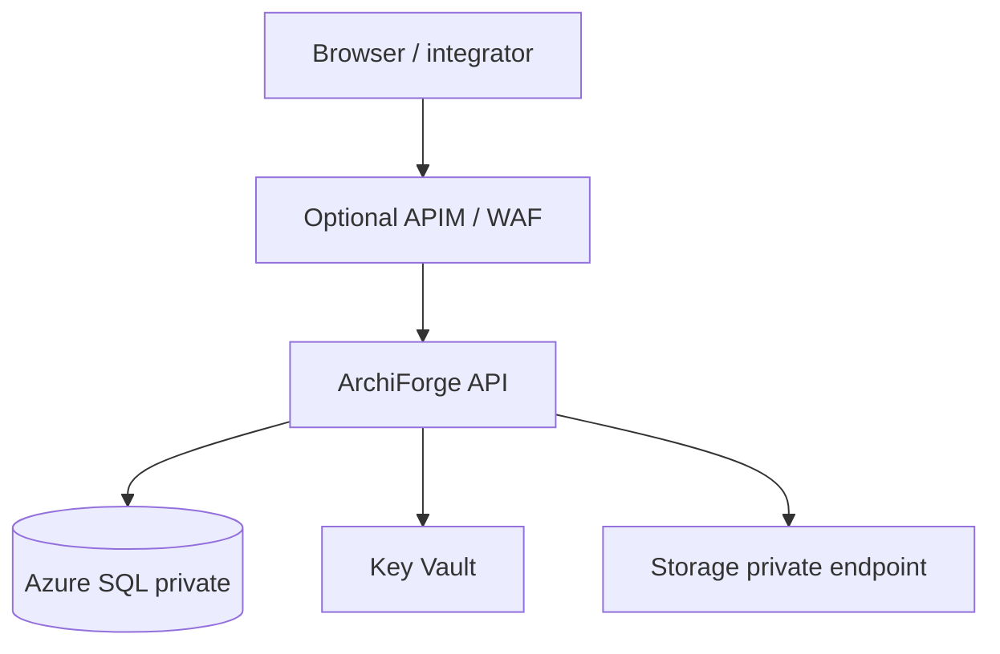

# Terraform / Azure variables (reference sketch)

**Purpose:** Map ArchiForge dependencies to IaC variables so environments stay reproducible. This is a **checklist**, not a full module.

## Core variables (typical)

| Variable / setting | Used for | Notes |
|--------------------|----------|--------|
| `sql_connection_string` (secret) | **`ConnectionStrings:ArchiForge`** | Prefer **private endpoint** SQL; no public `0.0.0.0/0`. |
| `storage_account_name` + keys / MI | Artifacts, optional file connectors | **Private endpoint**; **no public SMB 445** exposure. |
| `key_vault_uri` | Secrets, connection strings | App Service / Container Apps **Key Vault references**. |
| `cors_allowed_origins` | Browser SPA origins | Must match **`Cors:AllowedOrigins`** array in app config. |
| `app_insights_connection_string` | OTel / logs | Optional; align with **`Observability:*`** settings. |

## Diagram (dependencies)

## Constraints

- Align with org **landing zone** (subnets, DNS zones, private endpoints).
- Keep **DDL** in the single SQL file discipline (`ArchiForge.Data/SQL/ArchiForge.sql`) and apply via pipeline.
