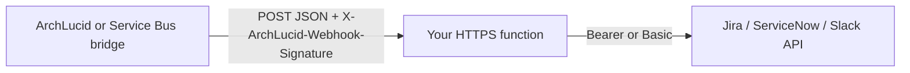

# Integration webhook recipes (ITSM / chat bridge)

**These templates are recipes, not first-party connectors.** You operate the HTTPS receiver, secrets, and outbound calls to Jira, ServiceNow, or Slack. ArchLucid does not ship or support those targets as productized connectors in V1.

**Release posture (documentation-sourced):**

- First-party **Jira** and **ServiceNow** connectors are **V1.1** candidates.
- First-party **Slack** as a chat-ops connector is **V2** (Microsoft Teams is the first-party chat surface for V1 / V1.1).

See [V1_DEFERRED.md](../../docs/library/V1_DEFERRED.md) (sections **6** and **6a**) for the authoritative table and rules.

## What is in this folder

| Recipe | Purpose |
|--------|---------|
| [jira/jira-webhook-receiver.md](jira/jira-webhook-receiver.md) | Validate inbound signed JSON, map catalog payload → Jira REST `POST /rest/api/3/issue`. |
| [servicenow/servicenow-incident-recipe.md](servicenow/servicenow-incident-recipe.md) | Same → ServiceNow Table API `POST /api/now/table/incident`. |
| [slack/slack-block-kit-recipe.md](slack/slack-block-kit-recipe.md) | Same → Slack Incoming Webhook + Block Kit (first-party Slack connector is V2). |

## Canonical contracts (do not fork schemas)

- Machine-readable event index: [schemas/integration-events/catalog.json](../../schemas/integration-events/catalog.json)
- Transport, CloudEvents envelope on HTTP, HMAC, and Service Bus notes: [INTEGRATION_EVENTS_AND_WEBHOOKS.md](../../docs/library/INTEGRATION_EVENTS_AND_WEBHOOKS.md)

**FindingRaised naming:** The catalog does not define a separate `FindingRaised` CloudEvent type. All three recipes use **`com.archlucid.alert.fired`** as the shared worked example (operator signal → ticket/message). Apply the same mapping pattern to other catalog types (for example `com.archlucid.authority.run.completed`) by swapping `data` field paths per the JSON Schema named in the catalog.

## Flow (nodes and edges)

Security: terminate TLS at your public endpoint, store the ArchLucid HMAC shared secret in a vault, use least-privilege API credentials for the ITSM target, and reject replays if you add idempotency keys (for example from `deduplicationKey` on alerts).
